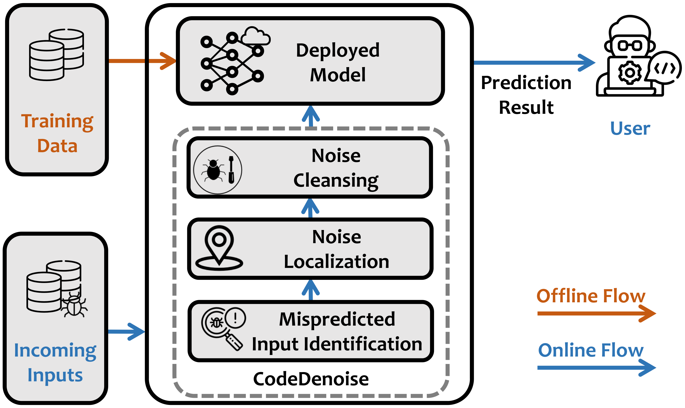

# CodeDenoise
--- ---
- [Overview](#overview)
  - [Folder Structure](#folder-structure)
- [Environment Configuration](#environment-configuration)
  - [Docker](#docker)
  - [Build tree-sitter](#build-tree-sitter)
  - [Subjects](#subjects)
- [Experiments](#experiments)
  - [Demo](#demo)
  - [Running Experiments](#running-experiments)
  - [Experimental Results](#experimental-results)
- [Acknowledgement](#acknowledgement) 

## Overview
--- ---


--- --- ---


### Folder Structure
--- --- ---
The folder structure is as follows.
```shell
.
|-- AuthorshipAttribution
|   |-- code
|   |-- dataset
|   `-- weights
|-- Cplusplus1000
|   |-- code
|   |-- dataset
|   `-- weights
|-- DefectPrediction
|   |-- code
|   |-- dataset
|   `-- weights
|-- FunctionalityClassification
|   |-- code
|   |-- dataset
|   `-- weights
|-- Java250
|   |-- code
|   |-- dataset
|   `-- weights
|-- Python800
|   |-- code
|   |-- dataset
|   `-- weights
|-- python_parser
|   |-- __pycache__
|   |-- parser_folder
|   |-- pattern.py
|   |-- run_parser.py
|   `-- test_parser.py
`-- utils.py
```


## Environment Configuration
--- ---
### Docker
--- ---
Our experiments were conducted under Ubuntu 20.04. 
We have made a ready-to-use docker image for this experiment.
```shell
docker pull anonymous4open/code_denoise:latest
```
Then, assuming you have NVIDIA GPUs, you can create a container using this docker image. 
An example:
```shell
docker run --name=code_denoise --gpus all -it --mount type=bind,src=./code_denoise,dst=/workspace anonymous4open/code_denoise:latest
```

### Build tree-sitter
--- --- ---
We use tree-sitter to parse code snippets and extract identifiers. You need to go to `./python_parser/parser_folder` folder and build tree-sitter using the following commands:
```shell
bash build.sh
```

### Subjects
--- --- ---
Statistics of datasets and of target models.


--- --- ---
We used 3 state-of-the-art pre-trained models (i.e., CodeBERT, GraphCodeBERT, and CodeT5) and 6 code-based datasets (i.e., Authorship Attribution, Defect Prediction, Functionality Classification C104, Functionality Classification C++1000, Functionality Classification Python800, and Functionality Classification Java250) in our study. These models and datasets have been widely used in many existing studies on evaluating the robustness of deep code models. By fine-tuning each pre-trained model on each dataset, we obtained 18 deep code models as the subjects in total in our study.

***All the subjects can be found in container.***


## Experiments
--- --- ---
### Demo
--- --- ---
Let's take the ***CodeBERT*** and ***Defect Prediction*** task as an example. 
The `code/saved_models` folder contains fine-tuned deep code models and fine-tuned MCIP models. 
The `dataset` folder contains the training and evaluation data for fine-tuning the pre-trained deep code models and MCIP models.
Run python denoise.py in each directory to denoise the mispredicted input code snippets for deep code models.
E.g., run the following commands to denoise the mispredicted input code snippets (CodeBERT x Defect Prediction).

```shell
cd /root/CodeDenoise/DefectPrediction/code/;
CUDA_VISIBLE_DEVICES=0 python denoise.py --model_name=codebert --theta=1 --N=1;
```


### Running Experiments
--- --- ---
We refer to the README.md files under each dataset folder to prepare the dataset and denoise inputs on different tasks. 


### Experimental Results
--- --- ---
####  (1) Effectiveness comparison in terms of CSR (↑)/MCR (↓).


--- --- ---


####  (2) Effectiveness comparison in terms of the overall accuracy (↑) of model.


--- --- ---


####  (3) Ablation test for CodeNoise in terms of CSR (↑)/MCR (↓)/the average number of identifier changes (↓).


--- --- ---


####  (4) Influence of hyper-parameter θ in terms of CSR (↑)/MCR (↓)/the average time spend on denoising an input (↓).


--- --- ---


####  (5) Influence of hyper-parameter N in terms of CSR (↑)/MCR (↓)/the average time spend on denoising an input (↓).


--- --- ---


## Acknowledgement
--- --- ---
We are very grateful that the authors of Tree-sitter, CodeBERT, GraphCodeBERT, and CodeT5 make their code publicly available so that we can build this repository on top of their code. 
